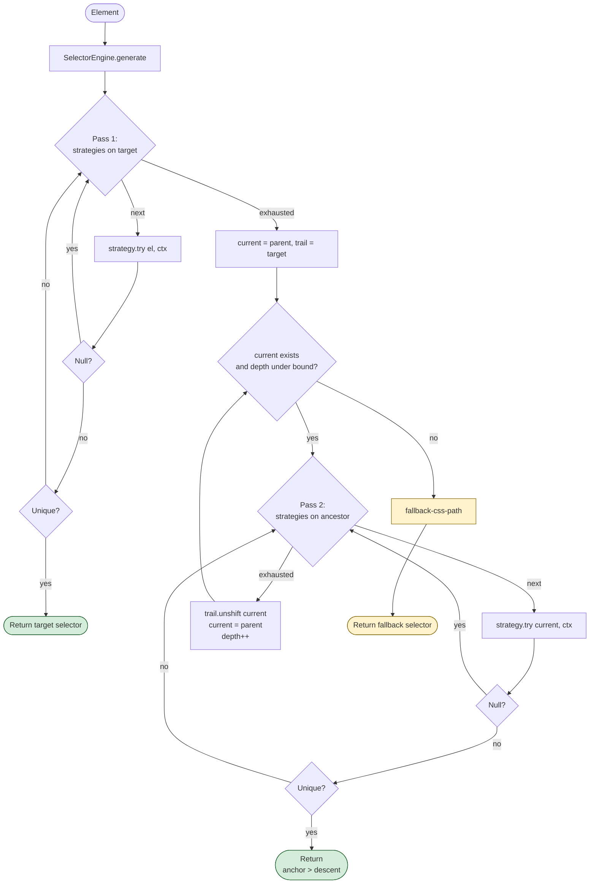
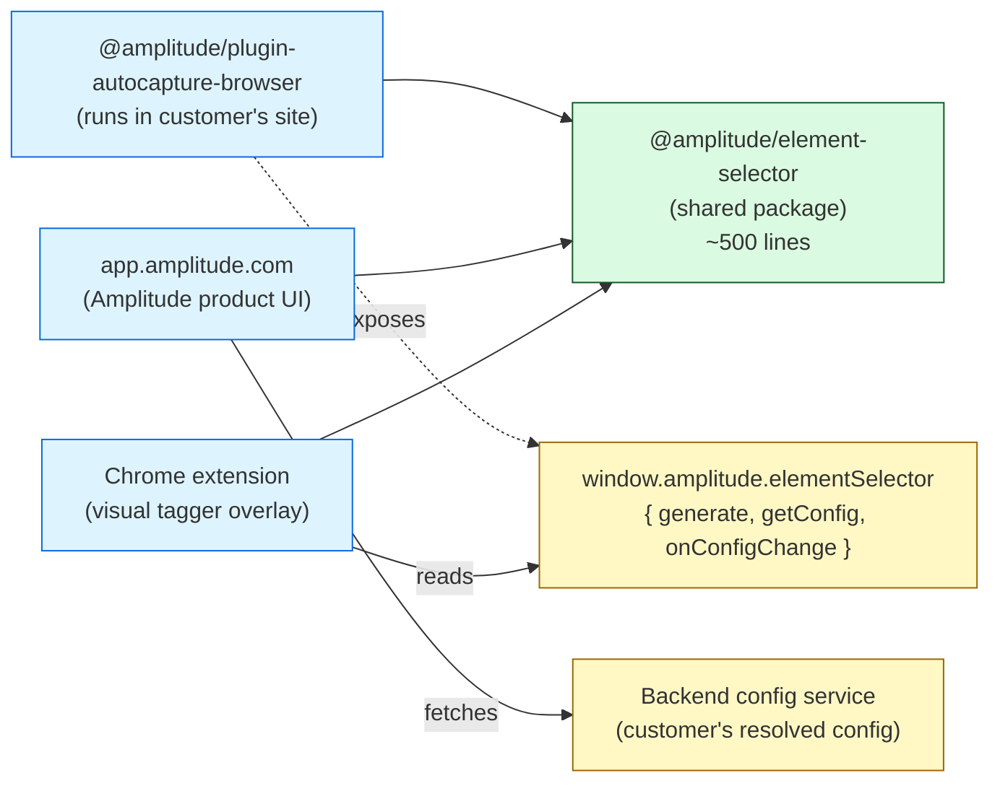

# Element Selector Strategy — v1

**Status:** ✅ Approved direction. Supersedes the with-classes alternative kept at [`element-selector-strategy.md`](./element-selector-strategy.md) for design-history reference.
**Owners:** Autocapture team (SDK), Product UI team (dashboard + chrome extension)
**Packages:** `@amplitude/element-selector` (new, shared), `@amplitude/plugin-autocapture-browser` (existing)

## Summary

v1 ships two strategies plus a hardened, class-filter-aware terminal fallback. The strategies are limited to customer overrides and stable-id detection; classes are never used as a primary selector anchor. The fallback filters both ids (autogenerated patterns) and classes (unstable patterns) so the structural path it emits is durable across re-renders and runtime state changes. The orchestrator walks the parent chain to `<html>` by default; an optional `maxAncestorWalkDepth` throttle is available via remote config for operators who want to bound per-event work.

The strategy chain:

1. **`explicitTrackingAttribute`** — honors `data-amp-track-id="value"` as an explicit anchor selector; treats empty `data-amp-track-id=""` as a *suppression* signal that prevents downstream consumers (the `stableId` strategy and the fallback) from using this element's id.
2. **`stableId`** — uses `tag#id` when the element's id is stable. Autogenerated ids (React `:r1:`, Radix, Headless UI, MUI, hex/UUID, etc.) are filtered out via the `AUTOGENERATED_ID_PATTERNS` regex pack.

Terminal fallback is `fallback-css-path`: a near-clone of legacy `cssPath` that (a) calls `getStableId` at every step so autogenerated ids are skipped throughout the walk, and (b) filters classes via `UNSTABLE_CLASS_PATTERNS` before sibling disambiguation so library state classes (Swiper `swiper-slide-active`, MUI `Mui-selected`, Radix `data-state-open`, etc.) never end up in the emitted selector.

Both pattern packs are remote-config-extensible (additive only, never destructive). The class strategy itself is deferred to a follow-up release — see [Why no class strategy in v1](#why-no-class-strategy-in-v1).

**The algorithm ships as a standalone package — `@amplitude/element-selector` — consumed by three surfaces: the autocapture SDK plugin, the app.amplitude.com tagging UI, and the Chrome extension visual tagger. Each consumer obtains its `ResolvedSelectorConfig` through a different mechanism appropriate to its execution context, but they all run identical selector logic. See [Consumer integration](#consumer-integration) for the full architecture.**

## Motivation

`element-path.ts` (adapted from Chromium DevTools) walks every ancestor from the target up to `<html>`, joining each step with `>`. It produces working selectors but is oblivious to two common sources of selector decay in modern apps:

1. **Autogenerated ids** — React `useId()` (`:r5:`), Radix (`radix-`), Headless UI, MUI internals, and library hash-suffixed ids change on every page load. Today's `cssPath` happily anchors on them.
2. **Library runtime state classes** — Swiper's `swiper-slide-active`, MUI's `Mui-selected`, Radix's `data-state-open`, and similar conventions move between elements as the user interacts. Today's `cssPath` happily includes them in sibling disambiguation, baking transient state into the selector.

ContentSquare's [Events handling](https://docs.contentsquare.com/en/web/events-handling/) algorithm tackles the first problem (id filtering, override mechanism, position-based descent) but not the second (they don't use classes at all). v1 covers both: the same regex-pack mechanism that filters autogenerated ids also filters unstable classes inside the fallback's disambiguation logic.

## Goals

- Stop emitting selectors that pin to autogenerated ids.
- Stop emitting selectors that include library runtime state classes (Swiper / MUI / Radix / Headless UI / BEM `is-*` etc.).
- Match ContentSquare's container-tagging ergonomics: a customer can put `data-amp-track-id` on a `<form>` or `<section>` and have descendant events identified relative to that anchor when no closer usable id exists.
- Make the strategy chain pluggable so additional strategies (test attributes, ARIA, classes, etc.) land later as small, independent PRs.
- Make both regex packs extensible at runtime via remote config so new framework patterns can be added without an SDK release.

## Non-goals (v1)

- **Class-based matching as a primary strategy.** Classes are *filtered* inside the fallback but cannot anchor a selector. See [Why no class strategy in v1](#why-no-class-strategy-in-v1) for the rationale.
- Test attributes, ARIA, role + accessible name, `href`, input `type`, `name`/`title`/`alt` — same plumbing pattern, deferred to follow-up releases.
- Cross-shadow-DOM / cross-iframe selectors. Current `cssPath` does not cross these boundaries; v1 preserves that scope.
- Changing the event property name (`[Amplitude] Element Path`) or wire format. Selector strings still join with `>`.

## Why no class strategy in v1

Two reasons, both surfaced by direct testing:

**Transient-class anchor pollution.** Classes are runtime state. Frameworks add and remove them constantly — hover styles, focus-visible helpers, transition states, loading flags, ARIA mirror classes, library state markers. A class strategy with a uniqueness check is vulnerable to anchoring on a class that's only present at the moment of the click. If the testbed adds a `picked` class for visual highlight during testing, the algorithm anchors on `button.picked` and produces a result that's "unique now, broken always." Production sites have the same problem in subtler forms.

**Pattern pack as moving target.** v1 needs `UNSTABLE_CLASS_PATTERNS` regardless (the fallback uses it). But the consequences of a missing pattern differ between a class strategy and the fallback:

- In the fallback, a missing pattern means an unstable class gets included in sibling disambiguation. Selector is slightly more brittle than ideal.
- In a class strategy, a missing pattern means an unstable class becomes the *anchor*. The selector is broken — different element selected on the next mount.

The failure mode in the fallback is degraded quality; the failure mode in the strategy is broken anchors. Same pattern pack, very different blast radius.

The class strategy slots cleanly into the existing chain when we ship it later — same registry, same orchestrator, same pattern pack. We'd want production data first on which class conventions actually need defaults.

## Architecture

### Module layout

v1 lives in its own monorepo package so it can be consumed by the SDK plugin, the app.amplitude.com dashboard, and the Chrome extension without code duplication.

```
packages/element-selector/                  ← NEW shared package
  src/
    index.ts                                // public: SelectorEngine, createSelectorEngine, types
    types.ts                                // Strategy, StrategyContext, ResolvedSelectorConfig
    registry.ts                             // name → Strategy lookup (extensible for future strategies)
    generate-identifier.ts                  // orchestrator + structural walk
    fallback-css-path.ts                    // hardened cssPath: filters autogenerated ids + unstable classes
    config.ts                               // resolveSelectorConfig(remote?, user?)
    create-engine.ts                        // createSelectorEngine helper for all three consumers
    helpers/
      get-stable-id.ts                      // shared helper: stableId strategy + fallback both call this
    strategies/
      explicit-tracking-attribute.ts        // data-amp-track-id="value"; empty value → suppress signal
      stable-id.ts                          // tag#id when id passes isStableId()
    patterns/
      autogenerated-ids.ts                  // DEFAULT_PATTERNS + compile() + isStableId()
      unstable-classes.ts                   // DEFAULT_PATTERNS + compile() + filterClasses()
  test/
    ...                                     // unit + property tests run independently of consumers
  package.json
  tsconfig.json

packages/plugin-autocapture-browser/
  package.json                              // adds dependency on @amplitude/element-selector
  src/
    autocapture-plugin.ts                   // constructs engine, exposes amplitude.elementSelector
    data-extractor.ts                       // uses engine for getElementPath when v1 enabled
    libs/element-path.ts                    // legacy cssPath, unchanged — used when v1 disabled

app.amplitude.com (dashboard)               // separate codebase, separate repo
  └── depends on @amplitude/element-selector
  └── fetches customer's resolved config from backend
  └── instantiates SelectorEngine via createSelectorEngine({ initialConfig })

chrome-extension (visual tagger)            // separate codebase
  └── depends on @amplitude/element-selector
  └── reads customer's config from window.amplitude.elementSelector when available
  └── falls back to bundled defaults when SDK isn't on the page
```

The shared package has zero runtime dependencies beyond `@amplitude/analytics-core` (for `ILogger`). It's pure: given an `Element` and a `ResolvedSelectorConfig`, return a selector string. That purity is what makes the multi-consumer model work — every surface running the package produces byte-for-byte identical selectors for the same DOM and config.

`libs/element-path.ts` inside the autocapture plugin keeps `cssPath` exported for backwards compatibility but is no longer called internally when v1 is enabled — `fallback-css-path` (in `@amplitude/element-selector`) is the v1 terminal. Legacy export deprecated in JSDoc.

### Core types

```ts
interface Strategy {
  readonly name: string;
  try(el: Element, ctx: StrategyContext): string | null;
}

interface StrategyContext {
  scope: ParentNode;
  config: ResolvedSelectorConfig;
}

interface ResolvedSelectorConfig {
  enabled: boolean;
  disabledStrategies: string[];               // names to skip (unknown names ignored)
  explicitTrackingAttribute: string;          // default 'data-amp-track-id'
  autogeneratedIdPatterns: RegExp[];
  unstableClassPatterns: RegExp[];
  maxAncestorWalkDepth?: number;              // optional throttle; absent = walk to <html>
}

interface SelectorEngine {
  // Generate a CSS selector for the given element using the engine's current config.
  generate(el: Element): string;

  // Replace the engine's config. Notifies any onConfigChange subscribers.
  updateConfig(next: ResolvedSelectorConfig): void;

  // Read-only access to the current config (for consumers that want to hydrate
  // their own engine, debug tooling, etc.).
  getConfig(): Readonly<ResolvedSelectorConfig>;

  // Subscribe to config changes. Returns an unsubscribe function.
  // Useful for the Chrome extension to hydrate its local engine and keep it
  // in sync with the SDK's resolved config.
  onConfigChange(cb: (config: ResolvedSelectorConfig) => void): () => void;
}

// Convenience factory used by all three consumers. Handles config resolution
// + optional remote-config subscription + engine construction in one call.
function createSelectorEngine(opts: {
  // Optional: an analytics-core RemoteConfigClient to subscribe to remote
  // config updates. Used by the SDK plugin (which already has one) and by
  // any consumer that wants live config updates from the server.
  remoteConfigClient?: RemoteConfigClient;
  // Optional: customer-supplied options passed to the plugin or UI.
  localOptions?: ElementSelectorRemoteConfig;
  // Optional: a pre-fetched config payload (e.g., the dashboard fetches the
  // customer's config server-side and passes it here).
  initialConfig?: ElementSelectorRemoteConfig;
  // Optional logger; defaults to a no-op.
  loggerProvider?: ILogger;
}): SelectorEngine;
```

### Generation flow

Two passes, ContentSquare-style. First the strategies run on the target itself — if either produces a unique selector, return it. Otherwise the orchestrator walks up the parent chain trying both strategies on each ancestor; the first ancestor that produces a unique selector becomes the *anchor*, and the target is described relative to it with `tag:nth-of-type(n)` segments. The walk continues all the way to `<html>` by default (an optional `maxAncestorWalkDepth` setting in remote config can throttle it). If the walk reaches the root without finding any unique ancestor, `fallback-css-path` produces a working selector as a last resort.



Pseudocode:

```
generate(el, ctx):
  enabledStrategies = STRATEGIES.filter(s => !ctx.config.disabledStrategies.includes(s.name))

  # Pass 1: try strategies on the target
  for strategy in enabledStrategies:
    sel = strategy.try(el, ctx)
    if sel and isUnique(sel, ctx.scope): return sel

  # Pass 2: walk up; first unique ancestor becomes anchor
  current = el.parentElement
  trail = [el]
  depth = 0
  while current:
    if ctx.config.maxAncestorWalkDepth !== undefined
        and depth >= ctx.config.maxAncestorWalkDepth: break
    for strategy in enabledStrategies:
      sel = strategy.try(current, ctx)
      if sel and isUnique(sel, ctx.scope):
        return sel + ' > ' + describeRelative(current, trail)
    trail.unshift(current)
    current = current.parentElement
    depth += 1

  # Pass 3: final safety net
  return fallbackCssPath(el, ctx.config)
```

This is target-first orchestration: at each level, try both strategies; first match wins. Closest match wins overall. Matches ContentSquare's algorithm: their walk is also target-first, looking for "usable id" (which subsumes both real ids and overrides). With only two strategies, target-first preserves customer intent in most cases — the suppress mechanism (`data-amp-track-id=""`) handles the corner case where customers want to force the walk past an inner id.

`describeRelative(anchor, trail)` builds the path from `anchor`'s first child in `trail` down to the target, using `tag:nth-of-type(n)` on each step. Matches ContentSquare's "position within identical markers."

**Walk depth bound.** By default the walk runs to `<html>` (no upper limit beyond the natural end of the parent chain). Per-event cost is negligible — DOM depth is finite, each strategy short-circuits cheaply when its condition is absent, and `querySelectorAll` only runs when a strategy returns non-null. Operators can supply `maxAncestorWalkDepth` in remote config as a defensive throttle for pathological pages; absent from config means unbounded.

### Shared helper: `getStableId`

Both the `stableId` strategy and the terminal fallback need to ask "is this element's id usable?" — the check lives in one helper:

```ts
export function getStableId(el: Element, cfg: ResolvedSelectorConfig): string | null {
  const trackAttr = el.getAttribute(cfg.explicitTrackingAttribute);
  if (trackAttr !== null && trackAttr === '') return null;          // suppress signal
  const id = el.getAttribute('id');
  if (!id) return null;
  if (cfg.autogeneratedIdPatterns.some(p => p.test(id))) return null;
  return id;
}
```

### v1 strategies

#### 1. `explicitTrackingAttribute` (highest priority)

```ts
export const explicitTrackingAttribute: Strategy = {
  name: 'explicitTrackingAttribute',
  try(el, ctx) {
    const value = el.getAttribute(ctx.config.explicitTrackingAttribute);
    if (value === null || value === '') return null;
    return `[${ctx.config.explicitTrackingAttribute}=${CSS.escape(JSON.stringify(value))}]`;
  },
};
```

Two semantics on one attribute. `data-amp-track-id="checkout-cta"` produces an explicit selector. `data-amp-track-id=""` is a *suppression* signal — strategy returns null, and downstream consumers (`stableId`, `fallback-css-path`) skip this element's id via `getStableId`.

#### 2. `stableId`

```ts
export const stableId: Strategy = {
  name: 'stableId',
  try(el, ctx) {
    const id = getStableId(el, ctx.config);
    if (!id) return null;
    return `${el.tagName.toLowerCase()}#${CSS.escape(id)}`;
  },
};
```

Returns `tag#id` only when the id is real, non-empty, doesn't match any autogenerated pattern, and isn't suppressed by an empty `data-amp-track-id`.

### Pattern packs

Two packs ship in code and compose with remote-config-supplied additions. Remote config can only **append** — never remove built-ins.

#### Autogenerated ids

Used by `getStableId` (consumed by the `stableId` strategy and the fallback).

```ts
export const DEFAULT_AUTOGENERATED_ID_PATTERNS: RegExp[] = [
  /^:r[0-9a-z]+:$/,            // React useId
  /^radix-:/,                  // Radix
  /^headlessui-/,              // Headless UI
  /^mui-/,                     // MUI
  /^[a-f0-9]{16,}$/,           // hex / UUID-ish
  /-\d{8,}$/,                  // ends in a long number
  /\d{4,}/,                    // any 4+ consecutive digits (matches ContentSquare's heuristic)
];
```

#### Unstable classes

Used by `fallback-css-path` to filter classes during sibling disambiguation. The fallback is the only consumer in v1 — there's no class strategy. Three categories:

```ts
export const DEFAULT_UNSTABLE_CLASS_PATTERNS: RegExp[] = [
  // --- Build-tool / framework utilities (Tailwind etc.) ---
  /^(p|m|px|py|mx|my|pt|pb|pl|pr|mt|mb|ml|mr)-\d+$/,    // spacing
  /^(w|h|min-w|max-w|min-h|max-h)-/,                    // sizing
  /^(text|bg|border|ring|fill|stroke)-/,                // color / visual
  /^(hover|focus|active|disabled|group-hover):/,        // state variants
  /^(sm|md|lg|xl|2xl):/,                                // breakpoint variants
  /^z-\d+$/,                                            // z-index
  /^data-\[/,                                           // arbitrary data attrs
  /^\[/,                                                // arbitrary selector variants like [&_.swiper-slide]:…

  // --- CSS-in-JS / build hashes ---
  /^css-[a-z0-9]{6,}$/,                                 // Emotion
  /^[a-zA-Z]+_[a-zA-Z0-9]{5,}__[a-zA-Z0-9]{5,}$/,       // CSS modules
  /^sc-[a-zA-Z0-9]{6,}$/,                               // styled-components
  /^jsx-\d+$/,                                          // styled-jsx

  // --- Library runtime state classes ---
  /^swiper-slide-(visible|fully-visible|active|prev|next|duplicate)$/,
  /^is-(active|open|selected|hovered|focused|expanded)$/,
  /^Mui[A-Z][a-zA-Z]+-(focused|selected|disabled|expanded|focusVisible|active|checked)$/,
  /^Mui-(selected|focused|disabled|expanded|focusVisible|active|checked)$/,
  /^data-state-/,                                       // Radix
];
```

The library-state-class group is the v1 differentiator: legacy `cssPath` includes these in sibling disambiguation, baking transient state into selectors. v1's fallback filters them so the emitted path uses `:nth-child(N)` instead.

### Terminal fallback (`fallback-css-path`)

A near-clone of legacy `cssPath` with two substantive changes:

1. Every place the original code reads `node.getAttribute('id')` and uses it, the new fallback calls `getStableId(node, cfg)` instead. Stable ids halt the walk as today; autogenerated and suppressed ids are skipped.
2. When sibling disambiguation triggers and the original code adds *every* class to the selector, the new fallback first runs both target and sibling class lists through `UNSTABLE_CLASS_PATTERNS`. Only surviving classes are considered for the subtraction check, and only surviving classes are appended to the emitted selector. If filtering removes every discriminating class, the fallback uses `:nth-child(N)` instead.

The effect on the swiper case:

- A `div.swiper-slide.swiper-slide-active.h-full.w-full` step with siblings containing `swiper-slide.swiper-slide-next.swiper-slide-prev` filters to `[swiper-slide]` on both sides; subtraction empties; falls back to `:nth-child(N)`. State classes never appear in the output.
- A target with a wrapper id like `swiper-wrapper-2e110fa710fd7e41039` (matches `\d{4,}`) gets the id skipped by `getStableId`; the wrapper step disambiguates against its (typically zero) same-tag siblings and emits a bare `div`.

The fallback is not wrapped in the `Strategy` interface and the orchestrator does not re-run uniqueness on it — it's designed to produce unique selectors by construction. If it ever returns an empty string (e.g. for a non-Element node), the engine returns the empty string — same as today.

## Worked examples

> Accuracy note: legacy `cssPath` only adds class disambiguation or `:nth-child(N)` at a level where a same-tag sibling exists. The fixtures below are intentionally simplified.

### Example 1 — Container tagging

```html
<form data-amp-track-id="login-form">
  <input id=":r3:" type="email" />
  <button class="px-4 py-2 bg-blue-500">Submit</button>
</form>
```
Click target: the `<button>`.

| Approach | Selector |
|---|---|
| ContentSquare *(`data-cs-override-id="login-form"`)* | `form#login-form>button` |
| Today (`cssPath`) | `html > body > form > button` |
| **v1** | **`[data-amp-track-id="login-form"] > button:nth-of-type(1)`** *(pass 1: explicit and stable both null on button; pass 2: walk hits `<form>`, explicit attribute matches, anchor)* |

### Example 2 — Target itself is tagged

```html
<button data-amp-track-id="signup-cta">Sign up</button>
```
Click target: the `<button>`.

| Approach | Selector |
|---|---|
| Today (`cssPath`) | `html > body > button` |
| **v1** | **`[data-amp-track-id="signup-cta"]`** *(pass 1 hits, no walk)* |

### Example 3 — Autogenerated React id, stable ancestor

```html
<main id="checkout">
  <section>
    <button id=":r5:">Submit</button>
  </section>
</main>
```
Click target: the `<button>`.

| Approach | Selector |
|---|---|
| ContentSquare | `main#checkout>section>button` |
| Today (`cssPath`) | `button#\:r5\:` *(uses the autogenerated id; selector breaks on next render)* |
| **v1** | **`main#checkout > section:nth-of-type(1) > button:nth-of-type(1)`** *(pass 1 on button: `:r5:` filtered by `getStableId`, both strategies null; pass 2: section has no usable id, walk to main, stable id matches, anchor)* |

The headline v1 fix: today's selector pins to a React id that changes on every mount. v1 walks past it.

### Example 4 — Suppress override on a semantically dynamic id

```html
<section id="catalog">
  <div class="product-card">First</div>
  <div id="row-A2" data-amp-track-id="">Item</div>
  <div class="product-card">Third</div>
</section>
```
Click target: the second `<div>`.

The id `row-A2` doesn't match any default autogenerated-id pattern. Without the suppress override, `cssPath` and v1's `stableId` would both treat it as usable. The empty `data-amp-track-id=""` is the explicit opt-out.

| Approach | Selector |
|---|---|
| ContentSquare *(`data-cs-override-id=""`)* | `section#catalog>div:nth-of-type(2)` |
| Today (`cssPath`) | `div#row-A2` *(uses the id, breaks every session)* |
| **v1** | **`section#catalog > div:nth-of-type(2)`** *(pass 1: explicit returns null for empty value, stable returns null because of suppress; pass 2: walk hits `<section id="catalog">`, anchor)* |

### Example 5 — No usable id anywhere (parity, modulo class filtering)

```html
<header>
  <nav>
    <button class="signup-cta px-4 py-2 bg-blue-500">Sign up</button>
  </nav>
</header>
```
Click target: the `<button>`.

| Approach | Selector |
|---|---|
| Today (`cssPath`) | `html > body > header > nav > button` *(no same-tag siblings shown → no class disambiguation in this simplified fixture)* |
| v1 | `html > body > header > nav > button` *(both strategies null at every level; falls to `fallback-css-path`)* |

For this fixture v1 matches today. The class strategy (deferred) would have anchored at `button.signup-cta`. The fallback's class-filter logic only kicks in where same-tag siblings exist; this fixture has none, so no class disambiguation happens at any level.

### Example 6 — Stable id (parity case)

```html
<form>
  <input id="search-input" type="search" />
</form>
```
Click target: the `<input>`.

| Approach | Selector |
|---|---|
| Today (`cssPath`) | `input#search-input` |
| v1 | `input#search-input` *(`stableId` hits on pass 1)* |

### Example 7 — Autogenerated id with no stable ancestor

```html
<div>
  <div>
    <button id=":r5:">Submit</button>
  </div>
</div>
```
Click target: the `<button>`.

| Approach | Selector |
|---|---|
| Today (`cssPath`) | `button#\:r5\:` *(uses the autogenerated id)* |
| **v1** | **`html > body > div > div > button`** *(`:r5:` filtered everywhere; no usable anchor in chain; falls to `fallback-css-path` which walks past the autogenerated id and produces a structural path)* |

Even without a stable ancestor, v1 still beats today by removing the autogenerated id from the selector. The structural path is brittle to layout changes but stable across re-renders.

### Example 8 — Swiper carousel (Rooms To Go shape)

Real-world DOM from `roomstogo.com`'s hero carousel. The wrapper id rotates per page load; the slide state classes (`swiper-slide-active`, `swiper-slide-visible`, etc.) move between slides as the carousel autoplays. Today's selector breaks on both axes.

```html
<div class="custom-swiper">
  <div class="swiper swiper-initialized swiper-horizontal">
    <div id="swiper-wrapper-2e110fa710fd7e41039" class="swiper-wrapper">
      <div class="swiper-slide swiper-slide-next swiper-slide-prev">…</div>
      <div class="swiper-slide swiper-slide-active">
        <div class="relative flex h-full items-center">
          
          <div class="flex flex-row gap-2 items-center">
            <h3>Active slide title</h3>
            <a href="#" class="z-10 active:bg-transparent underline">Learn More</a>
          </div>
        </div>
      </div>
    </div>
  </div>
</div>
```
Click target: the overlay `<a>` link inside the active slide.

| Approach | Selector |
|---|---|
| Today (`cssPath`) | `div#swiper-wrapper-2e110fa710fd7e41039 > div.swiper-slide.swiper-slide-active.h-full.w-full > div > div > a.…active\:bg-transparent.…` *(brittle on two axes — wrapper id rotates and `swiper-slide-active` migrates)* |
| **v1** | **`html > body > … > div:nth-child(2) > div > div > a`** *(pass 1: both strategies null on target; pass 2: walks the entire chain — wrapper id filtered by `\d{4,}`, no other strategies hit; falls to `fallback-css-path`. The slide-level step gets sibling disambiguation: filtered classes `[swiper-slide]` on both sides cancel out → emits `:nth-child(2)`. State classes never appear)* |

The output is structurally long but **stable across both page reloads and carousel scrolling** — the two problems today's selector has. The slide's `:nth-child(2)` is its DOM position, which doesn't change when the active class moves to a different slide.

**Caveat:** Swiper's `loop` mode reorders and duplicates slides in the DOM as the user navigates. If the customer uses loop mode, `:nth-child` is no longer fully stable. The only true fix in that case is the customer adding `data-amp-track-id` to each slide (or to the swiper container, depending on intent), which v1's container-tagging would honor.

## Configuration

Three layers, resolved at engine construction and on every remote-config update:

| Layer | Purpose | Source |
|---|---|---|
| Defaults | Shipped in code | `selector/config.ts` constants |
| Remote config | Operator-controlled overrides + extensions | `configs.analyticsSDK.browserSDK.elementSelector` |
| Local options | Customer-controlled overrides | `ElementInteractionsOptions.elementSelector` |

Precedence: **local > remote > defaults**. Pattern arrays are *additive* across layers; scalar fields follow strict precedence.

### Remote config payload

```ts
interface ElementSelectorRemoteConfig {
  // Global kill switch. When false, autocapture reverts to legacy cssPath.
  // Default after PR 3 lands: true.
  enabled?: boolean;

  // Strategies to skip. Names that don't match an existing strategy are dropped silently.
  // Example: ['stableId'] disables id-based anchoring (uncommon).
  // Cannot be used to *add* new strategies — they only exist if the SDK ships them.
  disabledStrategies?: string[];

  // Attribute name customers can put on elements to set/suppress anchors.
  // Empty value on an element = suppression signal.
  explicitTrackingAttribute?: string;             // default: 'data-amp-track-id'

  // Regex pattern strings (compiled to RegExp at resolve time).
  // Additive to built-in defaults — never replaces them.
  // Invalid regex strings are logged via loggerProvider.debug and skipped.
  extraAutogeneratedIdPatterns?: string[];
  extraUnstableClassPatterns?: string[];

  // Optional throttle on the ancestor walk. When absent the walk runs to <html>.
  // Useful as a defensive cap for pathological pages; the diagnostics histogram
  // surfaces real cases that would benefit from a limit.
  maxAncestorWalkDepth?: number;
}
```

Patterns arrive as strings, are compiled to `RegExp` once at resolve time inside a `try/catch`, and invalid patterns are logged via `loggerProvider.debug` rather than thrown — a malformed remote payload should never crash the page.

#### Concrete examples

**Minimal — flip on for a customer.** Empty payload; everything inherits defaults.

```json
{ "enabled": true }
```

**Customer-specific extension — adding patterns for a library we missed at launch.** Appends to the unstable-class pack; defaults stay.

```json
{
  "enabled": true,
  "extraUnstableClassPatterns": [
    "^my-widget-active$",
    "^my-widget-loading$"
  ]
}
```

**Throttle the walk for a customer with pathologically deep DOM.**

```json
{
  "enabled": true,
  "maxAncestorWalkDepth": 25
}
```

**Custom tracking attribute name.** For customers who already use a different convention.

```json
{
  "enabled": true,
  "explicitTrackingAttribute": "data-track"
}
```

**Emergency rollback.** Reverts to legacy `cssPath` for every customer.

```json
{ "enabled": false }
```

**Surgical strategy disable.** Turn off `stableId` for a customer whose ids contain confidential data.

```json
{
  "enabled": true,
  "disabledStrategies": ["stableId"]
}
```

### Local options

```ts
interface ElementInteractionsOptions {
  // ... existing fields
  elementSelector?: ElementSelectorRemoteConfig;  // same shape as remote
}
```

## Integration

### SDK plugin (autocapture)

A single integration point: `DataExtractor.getElementPath` in `src/data-extractor.ts:131-143`. Today's call to legacy `cssPath` becomes a call into the engine when v1 is enabled, with the legacy path preserved for the kill-switch state:

```ts
// data-extractor.ts
const elementPath = this.selectorEngine && this.selectorEngine.getConfig().enabled
  ? this.selectorEngine.generate(element)
  : cssPath(element);                              // legacy path for enabled=false
```

The engine is constructed once in `autocapture-plugin.ts` `setup()` using the `createSelectorEngine` helper from `@amplitude/element-selector`. The helper handles config resolution, optional remote-config subscription, and engine construction:

```ts
import { createSelectorEngine } from '@amplitude/element-selector';

const selectorEngine = createSelectorEngine({
  remoteConfigClient: config.fetchRemoteConfig ? config.remoteConfigClient : undefined,
  localOptions: options.elementSelector,
  loggerProvider: config.loggerProvider,
});

// Pass into DataExtractor for use in getElementPath
this.dataExtractor = new DataExtractor({ selectorEngine, /* … */ });
```

The plugin also exposes the engine on the customer's `amplitude` instance so that in-page consumers (notably the Chrome extension visual tagger) can use it directly without instantiating their own:

```ts
// At the end of setup(), attach to the customer-visible amplitude instance
amplitude.elementSelector = {
  getConfig: () => selectorEngine.getConfig(),
  generate: (el) => selectorEngine.generate(el),
  onConfigChange: (cb) => selectorEngine.onConfigChange(cb),
};
```

The existing `autocapturePlugin.getElementPath` performance histogram wraps the call unchanged.

### Remote-config wiring

The autocapture plugin already subscribes to `configs.analyticsSDK.pageActions` in `setup()` (lines 276–285). The new subscription sits beside it, gated by the same `config.fetchRemoteConfig` flag. In v1 this subscription lives inside `createSelectorEngine` rather than being open-coded in `setup()`:

```ts
// Inside @amplitude/element-selector/create-engine.ts
export function createSelectorEngine(opts) {
  const engine = new SelectorEngine(
    resolveSelectorConfig(opts.initialConfig, opts.localOptions)
  );
  if (opts.remoteConfigClient) {
    opts.remoteConfigClient.subscribe(
      'configs.analyticsSDK.browserSDK.elementSelector',
      'all',
      (remoteConfig) => {
        engine.updateConfig(
          resolveSelectorConfig(remoteConfig, opts.localOptions)
        );
      }
    );
  }
  return engine;
}
```

This means the autocapture plugin's `setup()` is short — one call to `createSelectorEngine(...)`. Consumers without an analytics-core `RemoteConfigClient` (the Chrome extension, app.amplitude.com) pass `initialConfig` instead and never subscribe.

## Consumer integration

The selector module is consumed by three independent surfaces. Each obtains its `ResolvedSelectorConfig` differently — appropriate to its execution context — but they all run identical selector logic and produce byte-for-byte identical output for the same DOM input with the same config.

### Consumer overview

| Consumer | Execution context | Config source | Engine instantiation |
|---|---|---|---|
| **autocapture SDK plugin** | Customer's website at runtime | `RemoteConfigClient` subscription to `configs.analyticsSDK.browserSDK.elementSelector` | `createSelectorEngine({ remoteConfigClient, localOptions })` |
| **app.amplitude.com tagging UI** | Amplitude product dashboard (separate origin) | Backend fetch of the customer's resolved config payload | `createSelectorEngine({ initialConfig: customerConfig })` |
| **Chrome extension visual tagger** | Customer's page (extension content script + injected main-world script) | Read from `window.amplitude.elementSelector.getConfig()` when the SDK is present; bundled defaults otherwise | `createSelectorEngine({ initialConfig: pageConfig })` or use `window.amplitude.elementSelector.generate(el)` directly |

### Architecture



### Consumer 1 — autocapture SDK plugin

Already covered in the [Integration](#sdk-plugin-autocapture) section above. Summary:

- `createSelectorEngine` is called in `autocapture-plugin.ts` `setup()` with the existing `RemoteConfigClient`.
- The engine is passed into `DataExtractor` and used by `getElementPath`.
- The engine is exposed on the customer-visible `amplitude` instance as `amplitude.elementSelector` so other in-page consumers (extension) can read it.

### Consumer 2 — app.amplitude.com tagging UI

The dashboard is a different origin from the customer's site. It can't reach the customer's running SDK. The customer's `elementSelector` config has to come through Amplitude's backend.

New backend endpoint (or extension of an existing config-service endpoint):

```
GET /api/customers/:customerId/config/elementSelector
→ { enabled, disabledStrategies?, explicitTrackingAttribute?, extraAutogeneratedIdPatterns?, extraUnstableClassPatterns?, maxAncestorWalkDepth? }
```

The dashboard fetches this once when entering the tagging flow, then constructs an engine:

```ts
import { createSelectorEngine } from '@amplitude/element-selector';

// Inside the dashboard's tagging UI
const customerConfig = await api.getCustomerElementSelectorConfig(customerId);

const engine = createSelectorEngine({
  initialConfig: customerConfig,        // hydrated from the backend
  localOptions: dashboardOverrides,     // dashboard-specific overrides (typically empty)
});

// When the user clicks an element on the page snapshot / live iframe:
const selector = engine.generate(targetElement);
// Store this as the zone's selector. It will match events the customer's SDK emits.
```

The dashboard's *own* analytics SDK (Amplitude tracking app.amplitude.com itself) is a separate concern — it runs its own engine with default config, unrelated to customer tagging.

**Config staleness.** The dashboard's engine doesn't subscribe to remote config; it gets a snapshot at tag-flow entry. If a customer changes their config mid-session (e.g., a CSM pushes a pattern update via remote config) and the user keeps tagging without refreshing, the dashboard's selectors briefly lag. Mitigations: re-fetch on a heartbeat (every N minutes), or expose a "refresh config" button in the tagging UI. Probably not necessary for v1 since customer config updates are rare and the staleness window is small.

### Consumer 3 — Chrome extension visual tagger

The extension runs on the customer's page, so the customer's SDK is right there on `window`. Two patterns, the extension can pick whichever fits its architecture:

**Pattern A — use the SDK's engine directly.** Simplest. No second engine, no config drift possible, customer-specific remote-config patterns automatically apply.

The extension's content script can't directly access `window.amplitude` (isolated world), so it needs to bridge to the main world. In Manifest V3:

```ts
// In the content script
chrome.scripting.executeScript({
  target: { tabId },
  world: 'MAIN',
  func: (selectorPickedEl) => {
    const api = window.amplitude?.elementSelector;
    return api ? api.generate(selectorPickedEl) : null;
  },
  args: [serializedElementHandle],
});
```

Or via a `<script>` tag injected into the page that listens for custom events from the content script.

**Pattern B — hydrate the extension's own engine from the SDK's config.** Useful if the extension generates many selectors (hover preview, bulk tagging) and the per-call MAIN-world bridge becomes a bottleneck.

```ts
// Main-world injected script reads from window.amplitude
const cfg = window.amplitude.elementSelector.getConfig();
// Send config to content script via postMessage / custom event

// Content script (isolated world)
import { createSelectorEngine } from '@amplitude/element-selector';
const engine = createSelectorEngine({ initialConfig: cfgFromPage });

// Subscribe to updates so the extension stays in sync if remote config changes during the session
window.amplitude.elementSelector.onConfigChange((newCfg) => engine.updateConfig(newCfg));
```

**Fallback when the SDK isn't on the page.** Some customer sites won't have autocapture loaded, or it may load after the extension activates. The extension should detect SDK presence and fall back gracefully:

```ts
function getSelectorEngine() {
  if (window.amplitude?.elementSelector) {
    // SDK is present — use Pattern A or hydrate via Pattern B
    return makeEngineFromSdk();
  }
  // Fallback: extension has its own engine bundled with defaults
  return createSelectorEngine({ initialConfig: { enabled: true } });
}
```

The fallback selectors won't have customer-specific remote-config patterns, but they're still better than today's `cssPath` since the defaults cover Swiper, MUI, Radix, and the standard Tailwind / CSS-in-JS patterns.

### Shared concerns across consumers

**Algorithm identity.** All three consumers run the same code from `@amplitude/element-selector`. There is no way for selectors to diverge between surfaces as long as their `ResolvedSelectorConfig` is the same.

**Config identity.** The three config-source mechanisms (subscription, backend fetch, in-page read) all deliver the same underlying payload — the customer's `configs.analyticsSDK.browserSDK.elementSelector` value. Defaults + remote additions + local options are merged consistently because they all go through `resolveSelectorConfig(...)`.

**Versioning.** The shared package follows semver. All three consumers should pin to compatible major versions (workspace ranges in the monorepo for the SDK; explicit version pinning for the dashboard and extension). Major bumps require coordinated updates across all consumers.

**Bundle size.** The shared package is ~500 lines of TypeScript, ~2-3KB gzipped. Negligible for the SDK (already shipping autocapture) and the dashboard (large app). Slight footprint for the Chrome extension, which can ship the package without the rest of autocapture.

**Kill switch consistency.** The `enabled: false` state in remote config disables v1 across all three consumers simultaneously — the SDK reverts to legacy `cssPath`, the dashboard's tagger reverts to... well, here we need to decide. Either the dashboard also keeps a legacy implementation, or it shows a "feature disabled for this customer" state. Same question for the Chrome extension. See [Open questions](#open-questions).

## Rollout plan

The v1 release spans three packages (`@amplitude/element-selector`, autocapture, dashboard) and one extension. Coordinated rollout:

### Phase 1 — Package landing

**PR 1.1 — `@amplitude/element-selector` package.** Stand up the new package with full v1 logic: types, registry, orchestrator with two-pass walk and `describeRelative`, `getStableId` helper, the two strategies (`explicitTrackingAttribute`, `stableId`), both pattern packs (`autogenerated-ids`, `unstable-classes`), class-filter-aware `fallback-css-path`, `createSelectorEngine` helper, and full unit + property test coverage. No consumers wired yet.

**PR 1.2 — autocapture takes a dependency on the new package.** Update `plugin-autocapture-browser`'s `package.json` and replace its internal selector module imports. No integration into `DataExtractor` yet; just dependency wiring and verification that the package builds and tests pass together.

### Phase 2 — Flag-gated integration

**PR 2.1 — SDK integration behind `enabled` flag (default off).** Construct the engine in `autocapture-plugin.ts` `setup()` via `createSelectorEngine`. Pass into `DataExtractor`. Gate the call inside `getElementPath` on `selectorEngine.getConfig().enabled`. Expose `amplitude.elementSelector` for downstream consumers. Lands the differential snapshot fixture comparing legacy `cssPath` output to v1 output across a corpus of representative DOMs (including Swiper, MUI, Radix samples).

**PR 2.2 — backend endpoint for dashboard config fetch.** Add the route that serves a customer's resolved `elementSelector` config to app.amplitude.com.

**PR 2.3 — dashboard tagging UI integration.** Replace the existing copied `cssPath` logic with `createSelectorEngine({ initialConfig })` hydrated from the new backend endpoint. Behind the same `enabled` flag, mirrored from the customer's config.

**PR 2.4 — Chrome extension integration.** Replace the extension's copied selector logic with reads from `window.amplitude.elementSelector` (when SDK present) or a bundled engine (when SDK absent). Same `enabled` flag governance.

After Phase 2, all four surfaces use v1 logic when the flag is on for a customer; otherwise everything falls back to legacy behavior. Default off everywhere.

### Phase 3 — Flag flip

**PR 3.1 — remote-config default flips to `true`.** Customers begin seeing new selectors across all three surfaces simultaneously. SDK emits v1 selectors in events; dashboard and extension generate v1 selectors when tagging — so saved zones match captured events.

**Recommended phased ramp** within PR 3.1: 1% → 10% → 100% over a controlled period. Hold at each stage to monitor:
- Diagnostics histogram on the SDK side (`autocapturePlugin.getElementPath`)
- Customer reports of selector or zone mismatches
- Dashboard's saved-analyses health (charts/cohorts that filter on `[Amplitude] Element Path` going to zero)

**Per-customer kill switch** remains available throughout via remote config. Flipping `enabled: false` for a single customer reverts all three of their surfaces in lockstep.

### Post-v1

Future strategies (class-based matching, test attributes, ARIA, role+aria, href, type, name/title/alt) land in the `@amplitude/element-selector` package as new strategy files. Each release flows automatically to all three consumers via their existing dependency. The class strategy in particular should be informed by production data on which class conventions show up most often as selector-decay culprits.

## Testing

Tests live in two tiers: the `@amplitude/element-selector` package's own test suite (algorithm correctness, independent of any consumer), and integration tests in each consumer that exercise the full path including config plumbing.

### Tier 1 — inside `@amplitude/element-selector`

| Layer | Approach |
|---|---|
| Strategy unit tests | JSDOM fixtures per strategy: `explicitTrackingAttribute` (set / empty / absent), `stableId` (stable id / autogenerated id / no id / suppressed id) |
| `getStableId` helper | Cross-product of suppress attribute × id presence × autogenerated-pattern match |
| Autogenerated-id pattern tests | Table-driven `should match` / `should not match`; corpus drawn from real React/Radix/Headless UI/MUI/Swiper ids |
| Unstable-class pattern tests | Table-driven; corpus drawn from real Tailwind, CSS-modules, styled-components, emotion, plus library state classes (Swiper, MUI, Radix, Headless UI) |
| Config compilation | Invalid regex strings from either pack don't throw, get logged |
| Orchestrator pass 1 | Strategy returns unique → returned; non-unique → falls through; null → falls through |
| Orchestrator pass 2 (walk) | Walk anchors at first ancestor where any strategy returns unique; descent uses `:nth-of-type`; respects `maxAncestorWalkDepth` when present |
| `describeRelative` | Builds `tag:nth-of-type(n)` segments correctly across various trail depths |
| `fallback-css-path` | Stable id present → halts; autogenerated id present → walks past; suppress attribute present → walks past; unstable classes present → filtered before sibling disambiguation; no id at any depth → produces a working structural path |
| `createSelectorEngine` factory | All three input modes work: `{ remoteConfigClient }`, `{ initialConfig }`, `{ localOptions }`. Updates propagate to subscribers via `onConfigChange` |
| Property test | `scope.querySelectorAll(generated)[0] === element` over a fixture corpus including Swiper, MUI, Radix, Tailwind, vanilla SSR |

### Tier 2 — per-consumer integration tests

| Consumer | Tests |
|---|---|
| autocapture SDK | Differential snapshot: legacy `cssPath(el)` vs `selectorEngine.generate(el)` over fixture DOMs. CI fails on diff. Engine exposed on `amplitude.elementSelector` and accessible to in-page consumers. Config updates via subscription propagate to engine. Kill switch (`enabled: false`) reverts to legacy `cssPath` correctly |
| app.amplitude.com dashboard | Backend fetch returns correct customer config. `createSelectorEngine({ initialConfig })` produces selectors matching what the SDK would emit on the same DOM with the same config. Saved zones match captured events end-to-end (integration test against a fixture customer site) |
| Chrome extension | Detects SDK presence on the page and reads config correctly. Generates selectors that match SDK output. Falls back to bundled defaults when SDK absent. `onConfigChange` propagation works through the main-world bridge |
| Cross-consumer parity | The same DOM + same config produces identical selector strings from all three consumers. Run via shared fixtures imported by each consumer's test suite from the shared package |

## Performance

Per-event cost is dominated by the structural walk in pass 2. With both strategies short-circuiting cheaply when their conditions are absent (one `getAttribute` for explicit, two `getAttribute`s + a regex pass for `stableId`), a typical no-tag page does roughly `2 × walkDepth` attribute reads and zero `querySelectorAll` calls before falling to `fallback-css-path`. For a 20-level walk that's ~40 attribute reads — a few microseconds.

Walks where a strategy returns non-null pay one `querySelectorAll` per hit. In practice this is bounded by 1–2 calls per event because the orchestrator short-circuits on the first unique match.

The walk runs to `<html>` by default. DOM depth is finite and traversal is cycle-free, so the upper bound is the page's actual depth — typically 15–30 levels on modern SPAs, occasionally 50+ on pages with deeply nested component trees. Even at the upper end, the per-event cost stays well below the diagnostics histogram's noise floor.

`maxAncestorWalkDepth` is available in remote config as a defensive throttle. If the existing `autocapturePlugin.getElementPath` histogram surfaces a customer hitting pathological depths (a chat widget inside a deeply nested article, an embedded ad iframe), we can set the cap remotely without an SDK release.

## Open questions

1. **`fallback-css-path` vs. legacy `cssPath`** — the v1 terminal is a hardened clone with class-filter-aware sibling disambiguation. Confirm we're OK shipping a second copy of that algorithm vs. modifying the original in place. Two-copy is safer (no risk of breaking external callers) but doubles maintenance.
2. **Format parity downstream** — confirm no analytics backend code parses `[Amplitude] Element Path` in a way that breaks on `:nth-of-type` segments, container-anchored selectors, or filtered-class structural paths. The differential snapshot in PR 2.1 will surface every change.
3. **Pattern-pack default coverage** — `AUTOGENERATED_ID_PATTERNS` and `UNSTABLE_CLASS_PATTERNS` are reasonable starts. Plan to harden the unstable-class pack via the remote-config extension path as new library state-class conventions surface in customer DOMs. Initial coverage targets the libraries we've validated against (Swiper, MUI, Radix, Headless UI, Emotion, styled-components, Tailwind including arbitrary-variant syntax).
4. **PR 3 ramp** — phased rollout (1% → 10% → 100%) vs. flat flip. Recommendation: phased.
5. **Class strategy follow-up** — when and how to add `tagAndFilteredClasses`. Suggested: collect 2–4 weeks of v1 production data, identify the customer apps where v1 produces unimproved selectors (no usable id anywhere), then design the class strategy + augment the pattern pack with what production data tells us. The two-pass walk already accommodates additional strategies without orchestrator changes.
6. **Kill-switch behaviour on the dashboard and extension.** When `enabled: false` is set for a customer, the SDK reverts to legacy `cssPath` cleanly. What should the dashboard and Chrome extension do? Three options: (a) also keep a legacy implementation and revert to it (preserves end-to-end matching with the SDK), (b) refuse to generate new zones / show a "feature disabled" state, (c) generate v1 selectors anyway and accept that zones won't match captured events while the SDK is on legacy. Recommend (a) but it doubles the consumer-side work.
7. **Dashboard config-fetch endpoint** — does the existing config-service API already expose customer-level `configs.analyticsSDK.*` payloads, or is a new endpoint needed? Affects scope of PR 2.2.
8. **Chrome extension's bundled fallback patterns** — when the customer's SDK isn't on the page, the extension uses bundled defaults. Should those defaults match the package's defaults exactly (simplest), or should they be a separate, more conservative set tuned for "we don't know which framework this site uses"? Recommend matching defaults — the package's defaults are already conservative.
9. **Coordinated release versioning** — when `@amplitude/element-selector` v2 ships with a breaking change, what's the rollout coordination across SDK, dashboard, and extension? Standard semver discipline plus a release checklist; worth documenting.

## Comparison: ContentSquare vs. this design

Legend: ✅ supported · 🟡 partial · ❌ not supported

### Capability matrix

| Capability | ContentSquare | v1 (PRs 1–3) | Future PRs |
|---|:---:|:---:|:---:|
| Walk up to first unique ancestor as anchor | ✅ | ✅ *(strategy chain runs on each ancestor in pass 2)* | ✅ |
| Use stable element `id` as anchor | ✅ | ✅ *(`stableId` strategy + hardened fallback)* | ✅ |
| **Customer container tagging** | ✅ `data-cs-override-id="value"` | ✅ `data-amp-track-id="value"` *(closer matches still win, ContentSquare-faithful)* | ✅ |
| **Customer override to suppress id** | ✅ `data-cs-override-id=""` *(empty)* | ✅ Empty `data-amp-track-id` suppresses id everywhere | ✅ |
| Filter dynamic IDs by regex | 🟡 *(single heuristic: 4+ digits)* | ✅ *(`AUTOGENERATED_ID_PATTERNS` pack)* | ✅ |
| **Filter library state classes from sibling disambiguation** | ❌ *(classes not used)* | ✅ *(`UNSTABLE_CLASS_PATTERNS` pack consumed by the fallback — covers Swiper, MUI, Radix, Headless UI, etc.)* | ✅ |
| Use class names to *anchor* a selector | ❌ | ❌ *(deliberate — see [Why no class strategy in v1](#why-no-class-strategy-in-v1))* | ✅ *(future `tagAndFilteredClasses`)* |
| Use ARIA / test attributes / href / type / name / title / alt | ❌ | ❌ | ✅ *(individual strategies)* |
| Explicit uniqueness validation (`querySelectorAll`) | ❌ | ✅ | ✅ |
| Anchor descent uses `:nth-of-type` | ✅ | ✅ | ✅ |
| Pattern extensibility at runtime *(no SDK release)* | ❌ | ✅ *(both packs, remote-config additive)* | ✅ |
| Customer kill-switch / rollout control | ❌ | ✅ *(remote + local config)* | ✅ |
| Per-strategy disable via remote config | ❌ | ✅ *(`disabledStrategies`)* | ✅ |
| Walk-to-`<html>` by default; optional throttle | ❌ *(walks to `<html>` always)* | ✅ *(walks to `<html>`; `maxAncestorWalkDepth` available as opt-in)* | ✅ |
| Robustness against transient runtime classes anchoring a selector | ✅ *(classes not used)* | ✅ *(classes never anchor; only filtered inside the fallback)* | 🟡 *(class strategy adds anchor exposure; mitigated by pattern pack)* |
| Localization safety *(selectors stable across i18n)* | ✅ *(id-only)* | ✅ *(tracking-attr + id strategies are i18n-safe)* | 🟡 *(aria/text strategies will be flagged i18n-sensitive)* |
| Per-call operational telemetry | ❌ | ✅ *(reuses existing `autocapturePlugin.getElementPath` histogram)* | ✅ |

### Format & behaviour notes

| Aspect | ContentSquare | v1 (PRs 1–3) |
|---|---|---|
| Default identifier sources | `id` (real or override) only | `data-amp-track-id` → stable `id` *(applied on target and ancestors)* |
| Anchor descent format | `tag:nth-of-type(n)` | `tag:nth-of-type(n)` |
| Sibling disambiguation in the fallback path | n/a | Filtered classes preferred; falls back to `:nth-child(N)` when no class survives filtering |
| Selector separator | `>` | `>` |
| Behaviour when nothing matches | Anchor at `<html>` | `fallback-css-path` — hardened `cssPath` that skips autogenerated ids, respects suppress, and filters library state classes from sibling disambiguation |

## Why we chose this shape over alternatives

Two alternatives were drafted and evaluated; see [`element-selector-strategy.md`](./element-selector-strategy.md) for the with-classes design (Option A) kept as a reference.

**v1 (Option B, this doc) — chosen.** Two strategies, hardened class-filter-aware fallback. Solves autogenerated ids, customer container/suppress tagging, and library-state-class brittleness. Cannot anchor on a class — classes only influence the fallback's sibling disambiguation.

**Option A — v1-with-classes — not chosen.** Adds a third strategy (`tagAndFilteredClasses`) that anchors on filtered class names. Produces shorter selectors for class-driven apps (Tailwind, BEM) but exposes a real failure mode: transient runtime classes (`is-hovered`, `is-loading`, framework-added focus helpers) can become the anchor and produce selectors that are unique at the moment of capture but break on the next state transition. The testbed demonstrated this concretely with an injected `picked` highlight class.

**Option C — v1-no-classes-as-originally-drafted — not chosen.** Same two strategies, but the fallback only filtered ids (not classes). Failed to solve the Rooms To Go swiper case: state classes like `swiper-slide-active` ended up in the fallback's sibling disambiguation, baking transient carousel state into the selector.

Option B is the smallest design that solves both autogenerated-id decay and library-state-class decay while keeping classes from ever becoming primary anchors. The class strategy can be added as a follow-up once we have production data on which class conventions actually need defaults.

## References

- [Existing `cssPath` implementation](packages/plugin-autocapture-browser/src/libs/element-path.ts)
- [`DataExtractor.getElementPath`](packages/plugin-autocapture-browser/src/data-extractor.ts#L131)
- [`@amplitude/analytics-core` `RemoteConfigClient`](packages/analytics-core/src/remote-config/remote-config.ts)
- [ContentSquare — Events handling](https://docs.contentsquare.com/en/web/events-handling/)
- [v1-with-classes alternative](./element-selector-strategy.md)
